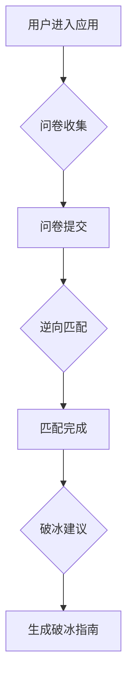

## 1. 产品概述
- **项目概述**: LumiLink是一个校园社交匹配系统，旨在通过多模态感知和LLM技术，帮助用户解决社交痛点，提供个性化的社交匹配和破冰建议。
- **主要目的**: 优化前端用户体验，实现页面流程化，提升用户交互的流畅性和美观度。
- **解决问题**: 解决当前应用页面混合、交互不流畅的问题，提升用户首次体验的吸引力。
- **目标用户**: 在校大学生。
- **产品价值**: 提高社交匹配的成功率和用户满意度，打造更智能、更人性化的校园社交平台。

## 2. 核心功能

### 2.1 功能模块
1. **问卷收集页面**: 收集用户昵称、兴趣、性格雷点、个人缺点等信息。
2. **逆向匹配页面**: 展示匹配过程和结果。
3. **破冰建议页面**: 根据匹配结果生成个性化的破冰开场白、场所建议和话题避坑指南。

### 2.2 页面详情
- **问卷收集页面**
  - **模块名称**: 用户信息表单
  - **功能描述**: 用户输入个人信息，包括昵称、兴趣、性格雷点、个人缺点。表单应有明确的输入提示和验证。
- **逆向匹配页面**
  - **模块名称**: 匹配结果展示
  - **功能描述**: 展示匹配成功的用户ID及正向理由。匹配过程应有加载动画或进度提示。
- **破冰建议页面**
  - **模块名称**: 破冰指南
  - **功能描述**: 展示三种风格的破冰开场白、破冰场所建议、话题避坑指南。

## 3. 核心流程
- 用户进入应用。
- **问卷收集**: 用户填写并提交问卷，完成后进入下一步。
- **视觉感知 (后台)**: 用户在填写问卷时或提交后，系统进行视觉感知，但前端不直接展示此过程，结果用于后续匹配。
- **逆向匹配**: 系统进行匹配，前端展示加载状态，匹配完成后进入下一步。
- **破冰建议**: 系统生成破冰建议，前端展示建议内容。

## 4. 用户界面设计
### 4.1 设计风格
- **主色调与辅助色**: 考虑使用清新的校园风格色调，如淡蓝色、浅绿色，搭配少量亮色作为强调色。
- **按钮样式**: 采用圆角按钮，具有一定的立体感或微动效，提升点击反馈。
- **字体与字号**: 选择易读且具有现代感的字体，例如思源黑体或阿里巴巴普惠体。字号层级清晰，突出重点信息。
- **布局风格**: 采用卡片式布局，每个模块独立且边界清晰。页面导航采用逐步引导的方式，确保用户焦点集中。
- **图标/表情符号建议**: 使用扁平化或线条风格的图标，可适当加入一些趣味性强的表情符号，增加亲和力。

### 4.2 页面设计概览
- **问卷收集页面**:
  - **模块名称**: 用户信息表单
  - **UI 元素**:
    - **样式**: 清新、简洁，背景可考虑模糊的校园风景图。
    - **布局**: 表单居中，各输入项间距适中，分组清晰。
    - **颜色**: 与整体色调保持一致，输入框边框或背景色可略有区分。
    - **字体**: 统一的字体风格，表单标签和输入内容区分。
    - **动画**: 输入框获取焦点时有微动效，提交按钮有点击反馈动画。
- **逆向匹配页面**:
  - **模块名称**: 匹配结果展示
  - **UI 元素**:
    - **样式**: 简洁、科技感，可加入一些微光、粒子等元素。
    - **布局**: 匹配过程可采用动画展示，结果以卡片形式突出显示。
    - **颜色**: 匹配成功时可有暖色调，失败时提示性颜色。
    - **字体**: 匹配结果文字突出，强调关键信息。
    - **动画**: 匹配过程动画，结果展示动画。
- **破冰建议页面**:
  - **模块名称**: 破冰指南
  - **UI 元素**:
    - **样式**: 温暖、人性化，可加入一些手绘风格的插画。
    - **布局**: 建议内容分块展示，排版清晰，易于阅读。
    - **颜色**: 整体采用柔和的色调。
    - **字体**: 建议内容可采用稍大的字号，易于阅读。
    - **动画**: 建议卡片进入动画，内容展开动画。

### 4.3 响应式设计
- **设计策略**: 桌面优先，移动端自适应。确保在不同屏幕尺寸下都能提供良好的用户体验。
- **优化**: 触摸优化，按钮和可点击区域大小适合触摸操作。