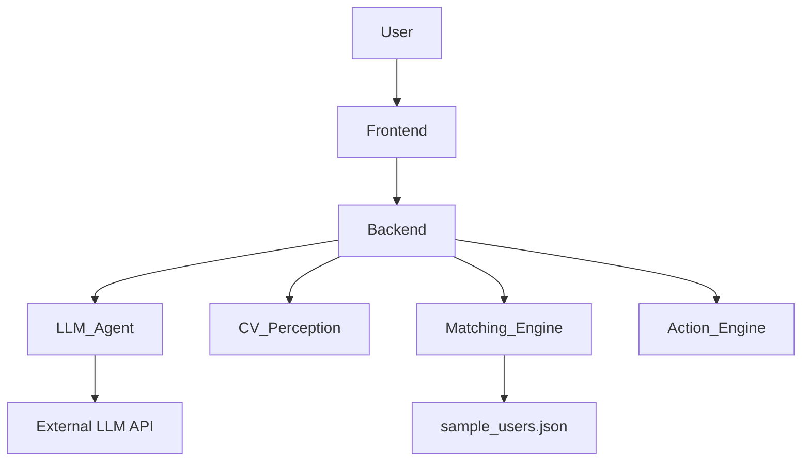
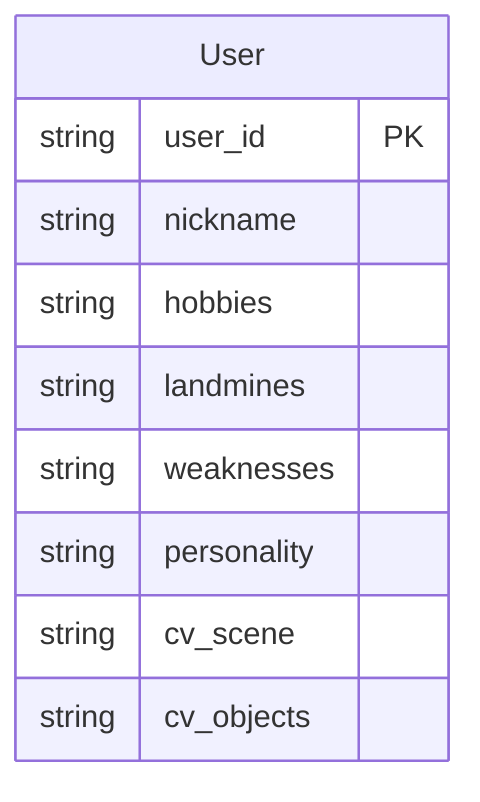

## 1. 架构设计

## 2. 技术栈描述
- **前端**: Gradio (继续沿用并进行美化和页面分离)
- **后端**: Python (现有项目后端逻辑)
- **LLM**: 兼容 OpenAI 协议的 LLM API (如 DeepSeek, GPT-4o)
- **CV**: ResNet18, YOLOv8 (通过 `modules/cv_perception.py` 调用)

## 3. 路由定义
| 路由        | 用途       |
|-------------|------------|
| /           | 问卷收集页面 |
| /matching   | 逆向匹配页面 |
| /icebreaker | 破冰建议页面 |

## 4. API 定义
- 由于 Gradio 框架的特性，前端与后端交互主要通过 Gradio 的组件回调函数实现，而非传统的 RESTful API。
- 数据传输将主要通过 Gradio 的 `gr.State` 或组件的 `value` 属性在不同页面或组件间传递。

## 5. 服务器架构图
- 现有架构中，后端逻辑与 Gradio UI 紧密结合，主要通过 Python 函数调用实现。

## 6. 数据模型
### 6.1 数据模型定义

### 6.2 数据定义语言
- 用户数据主要以 JSON 格式存储在 [data/sample_users.json](file:///e:/Projects/交大荣昶杯/LumiLink/data/sample_users.json) 中，后续可能考虑数据库存储。